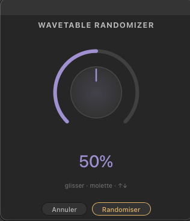

# Soulreaktive — Wavetable Randomizer

I always wish Ableton would add a random clickable button to their Instruments & Fx devices (not when they are racked), now it's possible with this 'lil extension. This is another cool starting point, when you find something sounding good, you can go further in sound designing Wavetable, or simply save this state as a new preset.

You can choose a percentage of randomness from 0 to 100%. Initial start is 50%.

## Installation

Double-click the `.ablx` file with Live Beta open (Developer Mode enabled in Preferences → Extensions).

## Usage

Right-click on a MIDI track (clip view or arrangement view) containing a Wavetable → search in extension menu: ***Soulreaktive - WavetableRandomizer*** → Start Randomize Wavetable

## What gets randomized

- Both oscillators (Osc 1 and Osc 2) — 75% chance of being ON
- Sub oscillator — 50% chance of being ON
- Filters 1 and 2
- Envelopes (Amp, Env 2, Env 3)
- LFOs 1 and 2
- Unison Amount
- Global Mod Amount

## What stays locked

- Volume — forced to -12dB
- Transpose / Detune — untouched
- Device On — always ON
- At least one oscillator always active
